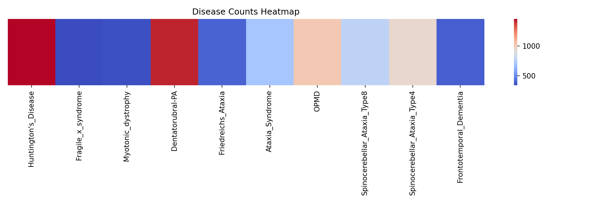
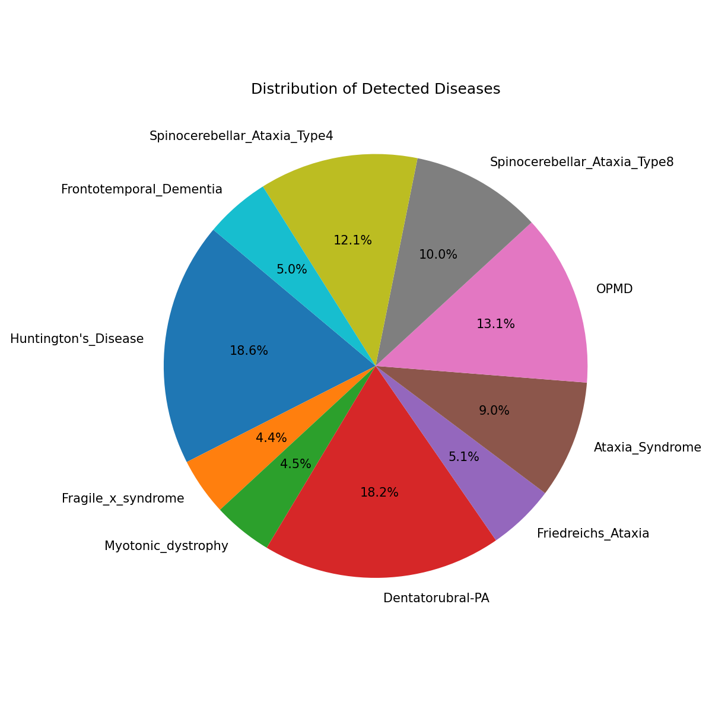
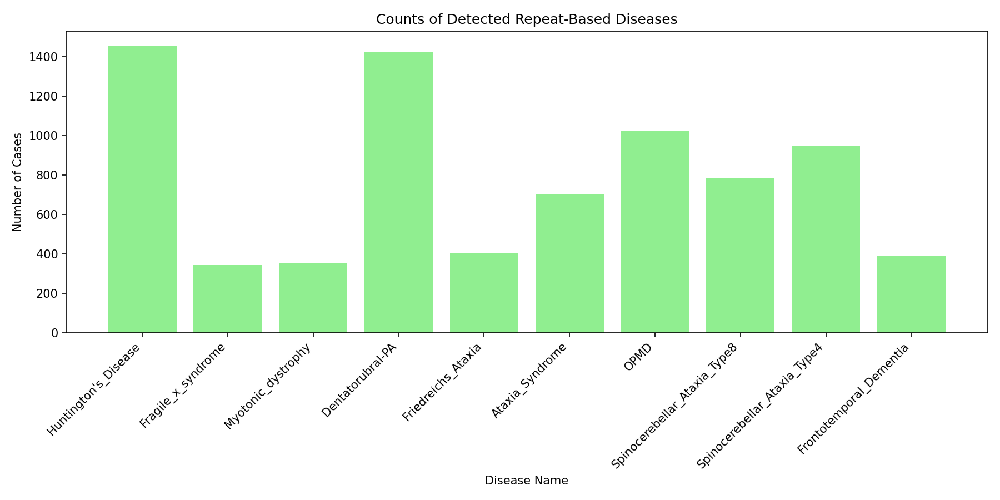

# 🧬 Gene Analysis — Repeat-Expansion Disease Detector

A Python mini project that scans DNA sequences for **disease-associated repeat motifs** (e.g. `CAG`, `CGG`, `GAA`), counts how many times each motif repeats back-to-back, and flags samples that cross the pathogenic threshold for 10 repeat-expansion disorders. Results are stored in a pandas DataFrame/CSV and visualised with Matplotlib and Seaborn.

> Mini Project — MIT World Peace University (MIT-WPU), Pune
> Guide: **Prof. Sheetal Girase**

## 👥 Team

| PRN | Name |
|---|---|
| 1262251822 | Sriyash Ghodke |
| 1262251588 | Priyanka Gupta |
| 1262252914 | Rayyan Ansari |
| 1262251995 | Shravya Bhatt |

## 📌 Problem Statement

Design and implement a Python-based system that reads a patient's DNA sequence and automatically detects disease-associated patterns (motifs) by searching for specific sub-sequences and counting their repetitions.

## ✨ Features

- Synthetic DNA dataset generator (4000 samples × 3000 bases, with disease repeats inserted at random positions)
- Repeat detector that finds the longest consecutive run of a motif in each sequence
- Detection of 10 repeat-based diseases, each with its own motif and threshold
- Results table with a `Found / Not Found` flag and repeat count per disease
- Heatmap, pie chart and bar graph of detected cases

## 🧪 Diseases and thresholds

| Disease | Motif | Pathogenic repeats |
|---|---|---|
| Huntington's Disease | `CAG` | ≥ 36 |
| Fragile X Syndrome | `CGG` | ≥ 200 |
| Myotonic Dystrophy | `CTG` | ≥ 50 |
| Dentatorubral-Pallidoluysian Atrophy | `CAG` | ≥ 40 |
| Friedreich's Ataxia | `GAA` | ≥ 66 |
| Ataxia Syndrome (FXTAS) | `CGG` | ≥ 55 |
| OPMD | `GGC` | ≥ 8 |
| Spinocerebellar Ataxia Type 8 | `CAG` | ≥ 70 |
| Spinocerebellar Ataxia Type 4 | `CAG` | 40 – 80 |
| Frontotemporal Dementia | `GGGGCC` | ≥ 30 |

## 🗂️ Project Structure

```
gene-analysis/
├── README.md
├── LICENSE
├── requirements.txt
├── .gitignore
├── src/
│   ├── config.py          # diseases, motifs, thresholds, paths
│   ├── detector.py        # repeat-counting logic
│   ├── generate_data.py   # builds the synthetic DNA dataset
│   ├── analyze.py         # runs detection -> results CSV
│   └── visualize.py       # heatmap, pie chart, bar graph
├── notebooks/
│   └── PROJECT.ipynb      # original exploratory notebook
├── data/
│   ├── sample_raw_data.txt   # first 25 sequences
│   └── sample_results.csv    # first 25 result rows
└── docs/
    ├── Mini_Project_Report.pdf
    └── figures/           # heatmap.png, pie_chart.png, bar_graph.png
```

The full dataset (`Raw_Data1.txt`, `results.csv`, ~12 MB each) is not committed. Regenerate it with the steps below.

## 🚀 Getting Started

```bash
git clone https://github.com/<your-username>/gene-analysis.git
cd gene-analysis
python -m venv .venv
# Windows: .venv\Scripts\activate    |    macOS/Linux: source .venv/bin/activate
pip install -r requirements.txt
```

Run the pipeline:

```bash
python src/generate_data.py --n 4000 --seed 42   # 1. create data/Raw_Data1.txt
python src/analyze.py                            # 2. detect repeats -> data/results.csv
python src/visualize.py                          # 3. save charts to docs/figures/
```

To try it on the included sample without generating anything:

```bash
python src/analyze.py --input data/sample_raw_data.txt --output data/sample_results.csv
```

## 📊 Results

Results from the run in the report (4000 samples):

| Disease | Samples flagged |
|---|---|
| Huntington's Disease | 1456 |
| Dentatorubral-PA | 1425 |
| OPMD | 1025 |
| Spinocerebellar Ataxia Type 4 | 947 |
| Spinocerebellar Ataxia Type 8 | 782 |
| Ataxia Syndrome | 704 |
| Friedreich's Ataxia | 402 |
| Frontotemporal Dementia | 388 |
| Myotonic Dystrophy | 355 |
| Fragile X Syndrome | 343 |

| Heatmap | Pie chart |
|---|---|
|  |  |



## ⚠️ Notes and Limitations

- **The data is synthetic.** Sequences are random A/C/G/T with repeats inserted on purpose, so this is a demonstration of the method, not clinical analysis.
- **Shared motifs overlap.** `CAG` is used by four diseases and `CGG` by two, so one inserted repeat can flag several diseases at once. Flag counts therefore add up to more than the number of diseased samples.
- **Not a diagnostic tool.** Real thresholds and repeat structures are more nuanced than a single motif count.

## 🛠️ Tech Stack

Python · pandas · NumPy · Matplotlib · Seaborn · Jupyter

## 📚 References

- [Jupyter](https://jupyter.org) · [Kaggle](https://www.kaggle.com) · [W3Schools](https://www.w3schools.com)
- [Matplotlib](https://matplotlib.org) · [Seaborn](https://seaborn.pydata.org) · [pandas](https://pandas.pydata.org)

## 📄 License

Released under the [MIT License](LICENSE).
